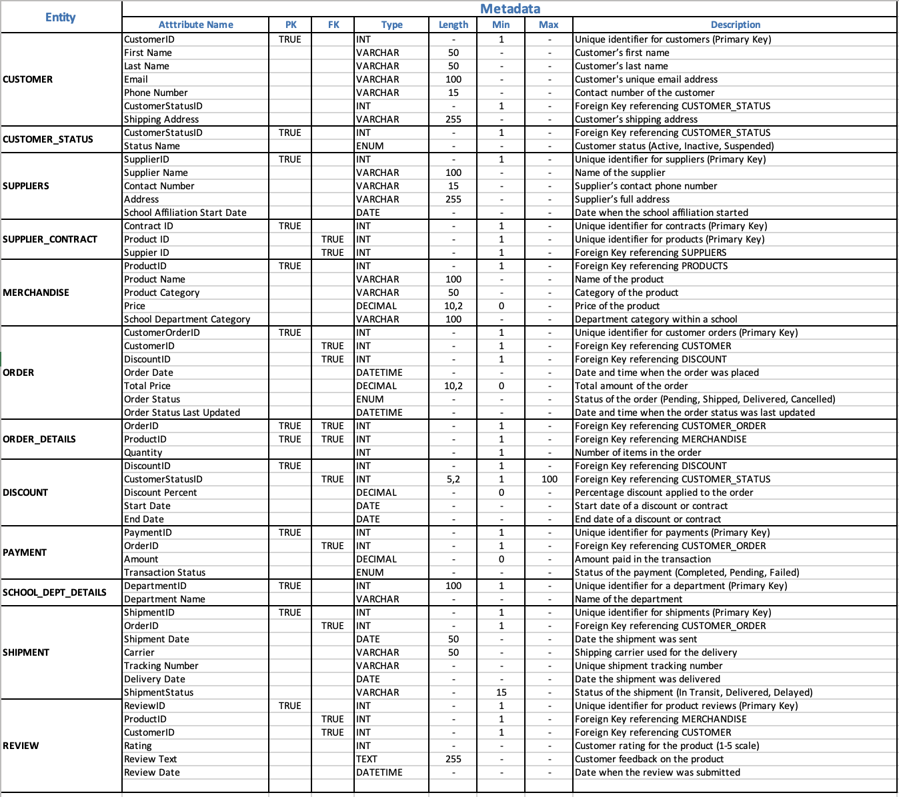

# 🛍️ UCI Spirit Store Database

## Overview
This project designs and analyzes a relational database for a fictional **UCI Spirit Shop**—an online store selling merchandise affiliated with the University of California, Irvine. The goal is to simulate a real-world business database, applying **conceptual design**, **normalization**, and **SQL queries** to derive business insights.

## Stage 1: Design A Conceptual Data Model

- Identified **key entities** and their **relationships**
  
  
- Designed **metadata** with attributes, data types, constraints, and examples
  
  
- Defined **relationships** and **business rules** for managing data
  
  

- Created an **ER diagram** to visualize relationships (using draw.io)

  
> Full Excel template file included in `data_dictionary/meta_deta.xlsx`

## Stage 2: Design A Logical Database

- Constructed relational schema diagrams with **primary/foreign keys**.

  
  
- Normalized all tables to **Third Normal Form (3NF)**.
  
  
  
- Designed and populated sample datasets for validation
  - All CSV files used for table simulation are located in the `/uci_merch_data` folder:
    ```
    customer_status.csv
    customers.csv
    merchandise.csv
    order_details.csv
    orders.csv
    payment.csv
    school_department_details.csv
    shipment.csv
    suppliers.csv
    ```
- Created an **ER diagram** in MySQL Workbench

## Stage 3: Business Insights Using SQL Queries

**1. Top 10 Best-Selling Products**
> Helps identify high-demand inventory for restocking and promotional campaigns.

**2. Most Expensive Products by School Department**
> Informs pricing strategies and department-specific merchandising.

**3. Top 10 High-Spending Customers**
> Enables customer segmentation and loyalty rewards targeting.

**4. Revenue by School Department**
> Supports stock planning and identifies profitable academic units.

**5. Shipment Efficiency**
> Evaluates shipping performance and fulfillment delays.

## Key Takeaways
- Applied full-cycle database design: **conceptual modeling, schema, and data analysis**
- Created a normalized, scalable schema tailored for an online merchandising business.
- Derived actionable insights using real SQL queries and relationships.

## Development Tools
- MySQL (SQL queries & schema creation)
- DrawIO (ER-Diagram, As-Is Dependency, Relational Modeling)
- Excel (metadata tables and data modeling)
- MySQL Workbench (ER diagrams, schema validation)
- VS Code + SQLFluff (SQL formatting)
  
## 📂 Repository Files
```
├── uci_merch_data/              # CSVs files for all tables
├── data_dictionary/             # Excel files with metadata, ERD, and entities relationships
├── figures/                     # Screenshots of ER diagram, as-is dependency, relational model, entities, metadata, and relationships
├── query_script.sql             # SQL file with business analysis queries
├── README.md                    # Project documentation
```

